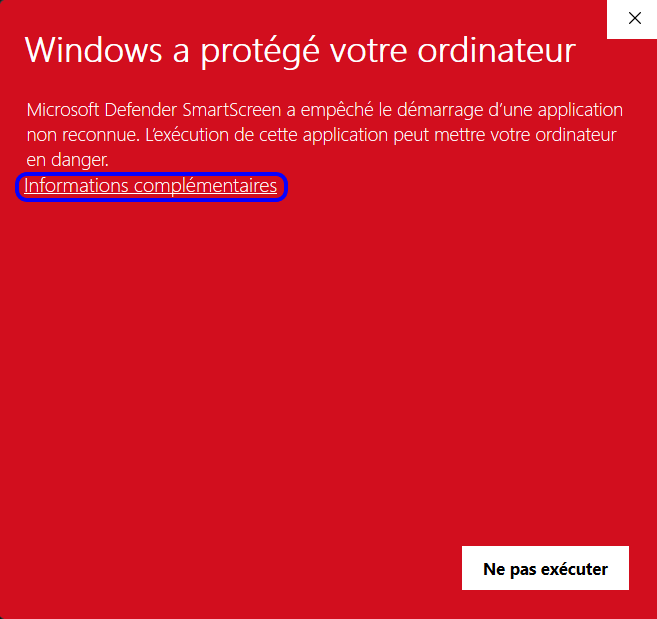
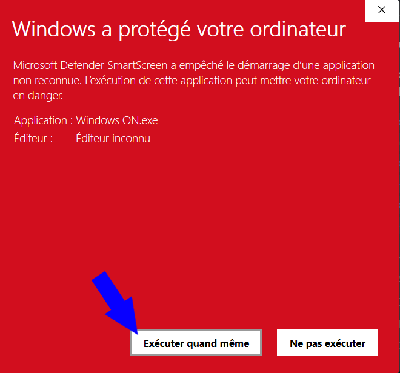
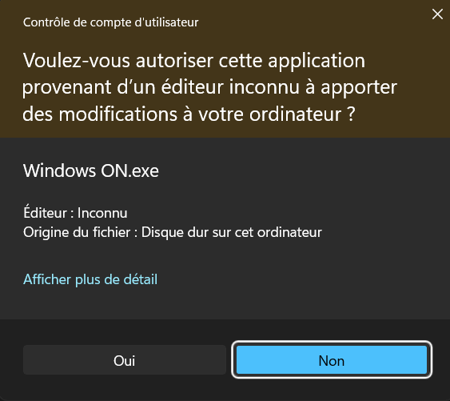

<h1 align="center">
 

 
Windows ON
 
</h1>

# Description of the script
This script has been created in batch to activate windows 10 or 11 for free

# Functions
- Activate Windows 10/11
- Activation using a windows key
- Uninstall Windows licence
- Check Windows activation status

# First run
If the images are in French, this means that my code is in French.
When you run Windows for the first time, it will try to protect you by displaying a window in the accentuation colour of your system (in my case red) but if you haven't changed, it will be blue.
When this happens, don't worry, you haven't been hacked or anything, it's perfectly normal. And if you doubt it, the source code is in the zip file, the .exe file and the script have been scanned by Total virus, so don't worry.
The reason for this is that the publisher is "unknown". 
To execute, click on "additional information".

Then press "Run anyway".

Then all you have to do is press yes on the window asking whether you agree to the application making changes to your computer.

Note that this will appear every time you run this executable next time.
